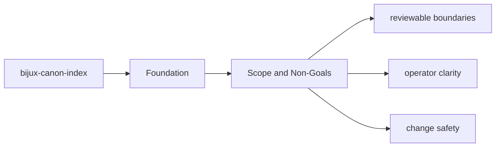
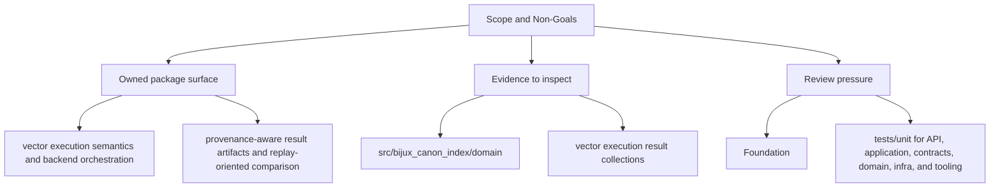

# Scope and Non-Goals

The package boundary exists so neighboring packages can evolve without hidden overlap.

## Page Maps

## In Scope

- vector execution semantics and backend orchestration
- provenance-aware result artifacts and replay-oriented comparison
- plugin-backed vector store, embedding, and runner integration
- package-local HTTP behavior and related schemas

## Out of Scope

- document ingestion and normalization
- runtime-wide replay policy and execution governance
- repository maintenance automation

## Purpose

This page keeps future work from leaking into the wrong package.

## Stability

Update it only when ownership truly moves into or out of `bijux-canon-index`.
