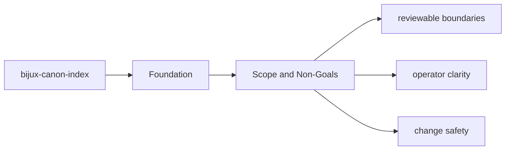
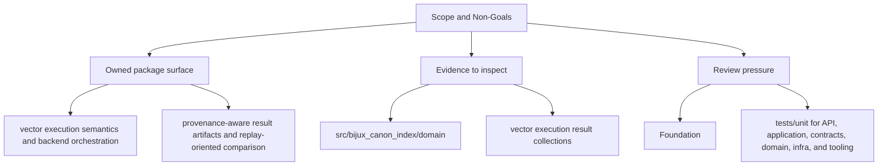

# Scope and Non-Goals

The package boundary exists so neighboring packages can evolve without hidden overlap.

## Page Maps

## In Scope

- vector execution semantics and backend orchestration
- provenance-aware result artifacts and replay-oriented comparison
- plugin-backed vector store, embedding, and runner integration
- package-local HTTP behavior and related schemas

## Out of Scope

- document ingestion and normalization
- runtime-wide replay policy and execution governance
- repository maintenance automation

## Concrete Anchors

- `packages/bijux-canon-index` as the package root
- `packages/bijux-canon-index/src/bijux_canon_index` as the import boundary
- `packages/bijux-canon-index/tests` as the package proof surface

## Use This Page When

- you need the package boundary before reading implementation detail
- you are deciding whether work belongs in this package or a neighboring one
- you need the shortest stable description of package intent

## What This Page Answers

- what bijux-canon-index is expected to own
- what remains outside the package boundary
- which neighboring seams a reviewer should compare next

## Reviewer Lens

- compare the stated package boundary with the owned modules and tests
- check that out-of-scope work is not quietly reintroduced through adjacent packages
- confirm that the package description still matches the real repository layout

## Honesty Boundary

This page can explain the intended boundary of bijux-canon-index, but it does not replace the code and tests that ultimately prove that boundary.

## Purpose

This page keeps future work from leaking into the wrong package.

## Stability

Update it only when ownership truly moves into or out of `bijux-canon-index`.
