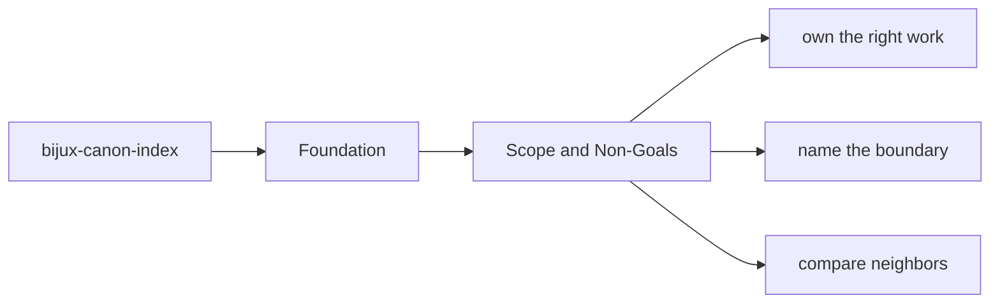
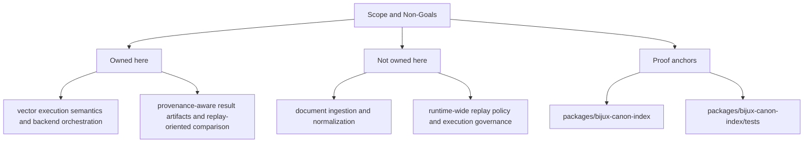

# Scope and Non-Goals

This page names the line that keeps `bijux-canon-index` useful instead of bloated.
The point of a package boundary is not to make work harder. It is to keep
neighboring packages from silently accumulating overlapping authority.

The non-goals matter as much as the goals. A package becomes easier to trust
when readers can see what it refuses to absorb just because the code happens to
be nearby.

Read the foundation pages for `bijux-canon-index` as the package's durable self-description. They should let a reader understand the package without needing to reconstruct its purpose from recent implementation history.

## Page Maps

## In Scope

- vector execution semantics and backend orchestration
- provenance-aware result artifacts and replay-oriented comparison
- plugin-backed vector store, embedding, and runner integration
- package-local HTTP behavior and related schemas

## Out of Scope

- document ingestion and normalization
- runtime-wide replay policy and execution governance
- repository maintenance automation

## Concrete Anchors

- `packages/bijux-canon-index` as the package root
- `packages/bijux-canon-index/src/bijux_canon_index` as the import boundary
- `packages/bijux-canon-index/tests` as the package proof surface

## Use This Page When

- you need the package idea before the implementation detail
- you are deciding whether work belongs here or in a neighboring package
- you want the shortest honest explanation of what this package is for

## Decision Rule

Use `Scope and Non-Goals` to decide whether a change makes `bijux-canon-index` easier or harder to defend as one distinct role in the overall system. If the work makes the package broader without making its role clearer, stop and re-check the boundary before treating the change as a local improvement.

## What This Page Answers

- what problem `bijux-canon-index` is supposed to own on purpose
- where the package boundary stops, even when nearby code looks tempting
- which neighboring package seams deserve comparison before the boundary is changed

## Reviewer Lens

- compare the stated boundary with the modules, artifacts, and tests that are supposed to uphold it
- check that out-of-scope behavior is not quietly re-entering through convenience paths
- confirm that the package story still matches the real repository layout and neighboring package docs

## Honesty Boundary

This page can explain the intended boundary of `bijux-canon-index`, but it cannot prove that boundary by itself. The real proof still lives in the code, tests, and neighboring package seams that either support or contradict the story told here.

## Next Checks

- move to architecture when the question becomes structural rather than boundary-oriented
- move to interfaces when the question becomes contract-facing
- move to quality when the question becomes proof or review sufficiency

## Purpose

This page keeps future work from leaking into the wrong package.

## Stability

Update it only when ownership truly moves into or out of `bijux-canon-index`.
