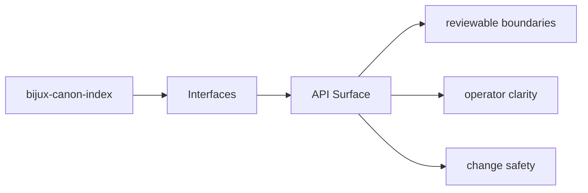

# API Surface

HTTP-facing behavior should be discoverable from tracked schema files and the owning API modules.

## Page Maps

## API Artifacts

- apis/bijux-canon-index/v1/schema.yaml
- apis/bijux-canon-index/v1/openapi.v1.json

## Boundary Modules

- CLI modules under src/bijux_canon_index/interfaces/cli
- HTTP app under src/bijux_canon_index/api
- OpenAPI schema files under apis/bijux-canon-index/v1

## Purpose

This page ties API behavior to tracked code and schema assets.

## Stability

Keep it aligned with the actual API modules and schema files.
