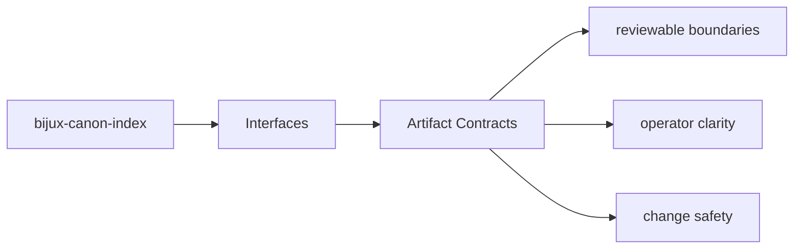
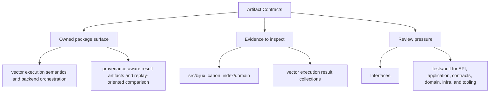

# Artifact Contracts

Produced artifacts are part of the package contract whenever another package, operator,
or replay workflow depends on them.

## Page Maps

## Current Artifacts

- vector execution result collections
- provenance and replay comparison reports
- backend-specific metadata and audit output

## Use This Page When

- you need the public command, API, import, or artifact surface
- you are checking whether a caller can rely on a given shape or entrypoint
- you need the contract-facing side of the package before using it

## What This Page Answers

- which public or operator-facing surfaces bijux-canon-index exposes
- which artifacts and schemas act like contracts
- what compatibility pressure this surface creates

## Reviewer Lens

- compare commands, API files, imports, and artifacts against the documented surface
- check whether schema or artifact changes need compatibility review
- confirm that operator-facing examples still point at real entrypoints

## Purpose

This page marks which outputs need stable review when behavior changes.

## Stability

Keep it aligned with the package outputs that are actually produced and consumed.
