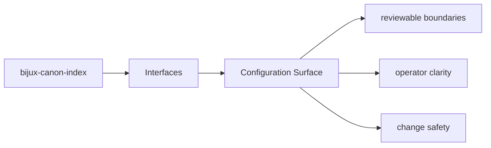

# Configuration Surface

Configuration belongs at the package boundary, not scattered through unrelated modules.

## Page Maps

## Configuration Anchors

- CLI modules under src/bijux_canon_index/interfaces/cli
- HTTP app under src/bijux_canon_index/api
- OpenAPI schema files under apis/bijux-canon-index/v1

## Review Rule

Configuration changes should update the operator docs, schema docs, and tests that protect the same behavior.

## Purpose

This page explains where configuration enters the package and how it should be reviewed.

## Stability

Keep it aligned with real configuration loaders, defaults, and operator-facing options.
