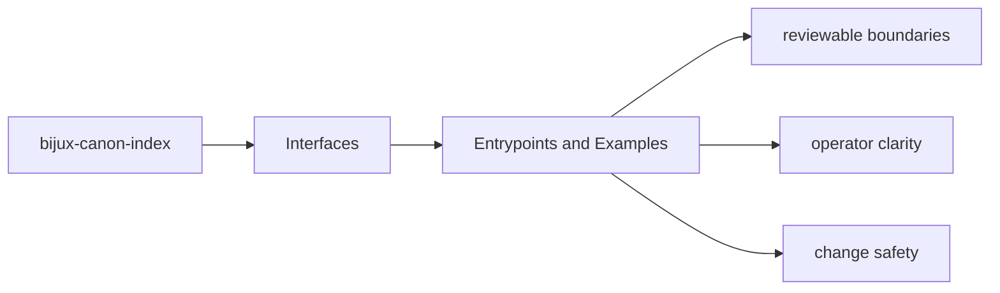
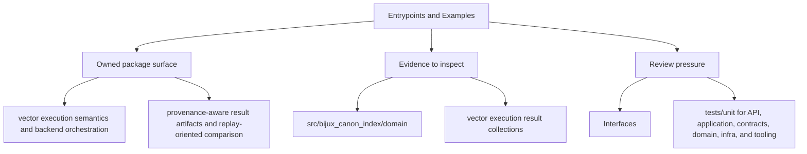

# Entrypoints and Examples

The fastest way to understand the package interfaces is to pair entrypoints with concrete examples.

## Page Maps

## Entrypoints

- CLI modules under src/bijux_canon_index/interfaces/cli
- HTTP app under src/bijux_canon_index/api
- OpenAPI schema files under apis/bijux-canon-index/v1

## Example Anchors

- tests/e2e and tests/scenarios as executable usage guides
- apis/bijux-canon-index/v1/openapi.v1.json for HTTP contract shape

## Purpose

This page records where maintainers can find real invocation examples instead of inventing them from scratch.

## Stability

Keep it aligned with the checked-in examples, fixtures, and executable tests.
