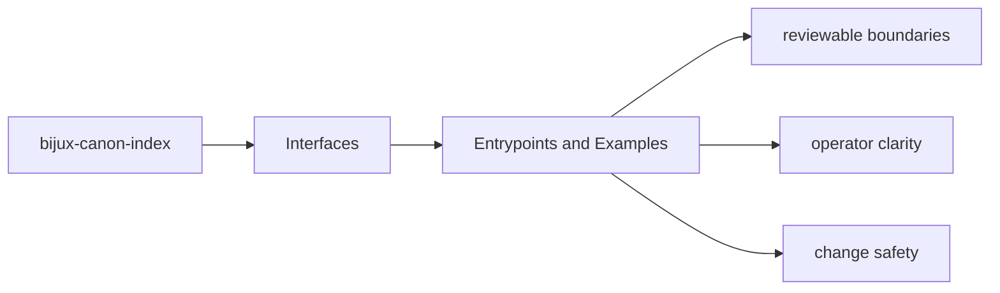
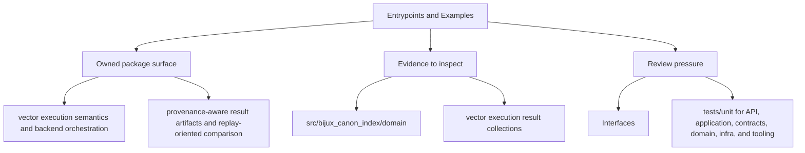

# Entrypoints and Examples

The fastest way to understand the package interfaces is to pair entrypoints with concrete examples.

## Page Maps

## Entrypoints

- CLI modules under src/bijux_canon_index/interfaces/cli
- HTTP app under src/bijux_canon_index/api
- OpenAPI schema files under apis/bijux-canon-index/v1

## Example Anchors

- tests/e2e and tests/scenarios as executable usage guides
- apis/bijux-canon-index/v1/openapi.v1.json for HTTP contract shape

## Concrete Anchors

- CLI modules under src/bijux_canon_index/interfaces/cli
- HTTP app under src/bijux_canon_index/api
- OpenAPI schema files under apis/bijux-canon-index/v1
- apis/bijux-canon-index/v1/schema.yaml

## Use This Page When

- you need the public command, API, import, or artifact surface
- you are checking whether a caller can rely on a given shape or entrypoint
- you need the contract-facing side of the package before using it

## What This Page Answers

- which public or operator-facing surfaces bijux-canon-index exposes
- which artifacts and schemas act like contracts
- what compatibility pressure this surface creates

## Reviewer Lens

- compare commands, API files, imports, and artifacts against the documented surface
- check whether schema or artifact changes need compatibility review
- confirm that operator-facing examples still point at real entrypoints

## Honesty Boundary

This page can identify the intended public surfaces of bijux-canon-index, but real compatibility still depends on code, schemas, artifacts, and tests staying aligned.

## Purpose

This page records where maintainers can find real invocation examples instead of inventing them from scratch.

## Stability

Keep it aligned with the checked-in examples, fixtures, and executable tests.
