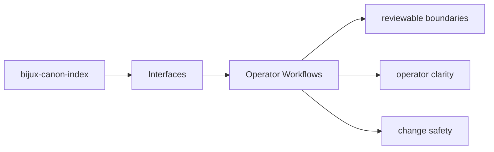

# Operator Workflows

Operator workflows should start from documented package entrypoints and end in reviewable outputs.

## Page Maps

## Workflow Anchors

- entry surfaces: CLI modules under src/bijux_canon_index/interfaces/cli, HTTP app under src/bijux_canon_index/api, OpenAPI schema files under apis/bijux-canon-index/v1
- durable outputs: vector execution result collections, provenance and replay comparison reports, backend-specific metadata and audit output
- validation backstops: tests/unit for API, application, contracts, domain, infra, and tooling, tests/e2e for CLI workflows, API smoke, determinism gates, and provenance gates

## Purpose

This page connects package interfaces to the workflows an operator actually performs.

## Stability

Keep it aligned with the existing commands, endpoints, and outputs.
