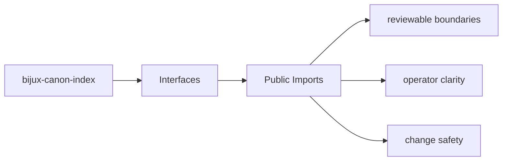

# Public Imports

The public Python surface of `bijux-canon-index` starts at the package import root and any
intentionally exported modules beneath it.

## Page Maps

## Import Anchor

- import root: `bijux_canon_index`
- package source root: `packages/bijux-canon-index/src/bijux_canon_index`

## Purpose

This page keeps the import-facing contract visible when refactoring package internals.

## Stability

Keep it aligned with the actual package source tree and documented import paths.
