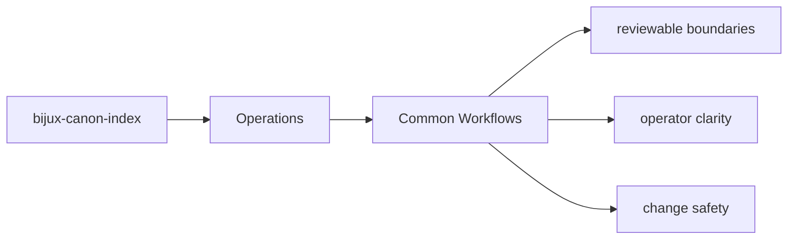

# Common Workflows

Most work on `bijux-canon-index` follows one of a few recurring paths.

## Page Maps

## Recurring Paths

- inspect the package README and section indexes first
- follow an interface into the owning module group
- run the owning tests before declaring the change complete

## Code Areas

- `src/bijux_canon_index/domain` for execution, provenance, and request semantics
- `src/bijux_canon_index/application` for workflow coordination
- `src/bijux_canon_index/infra` for backends, adapters, and runtime environment helpers
- `src/bijux_canon_index/interfaces` for CLI and operator-facing edges
- `src/bijux_canon_index/api` for HTTP application surfaces
- `src/bijux_canon_index/contracts` for stable contract definitions

## Purpose

This page makes common package workflows easier to repeat consistently.

## Stability

Keep it aligned with the actual package structure and tests.
