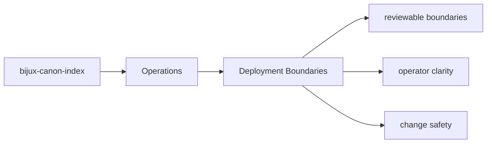
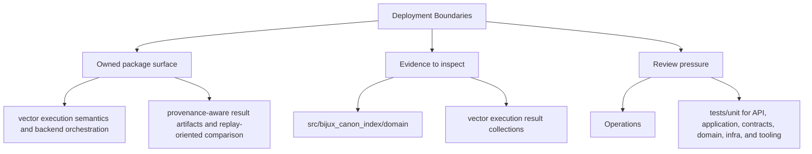

# Deployment Boundaries

Deployment for `bijux-canon-index` should respect the package boundary instead of assuming the full repository is always present.

## Page Maps

## Boundary Facts

- package root: `packages/bijux-canon-index`
- public metadata: `packages/bijux-canon-index/pyproject.toml`
- release notes: `packages/bijux-canon-index/CHANGELOG.md` when present

## Use This Page When

- you are installing, running, diagnosing, or releasing the package
- you need operational anchors rather than conceptual framing
- you are responding to package behavior in a local or CI environment

## What This Page Answers

- how bijux-canon-index is installed, run, diagnosed, and released
- which files or tests matter during package operation
- where an operator should look when behavior changes

## Purpose

This page reminds maintainers that packages are publishable units, not just folders in one repo.

## Stability

Keep it aligned with the package's actual distributable surface.
