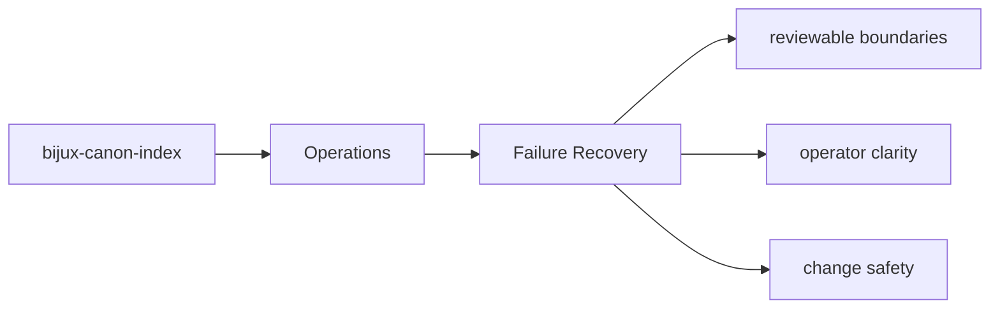
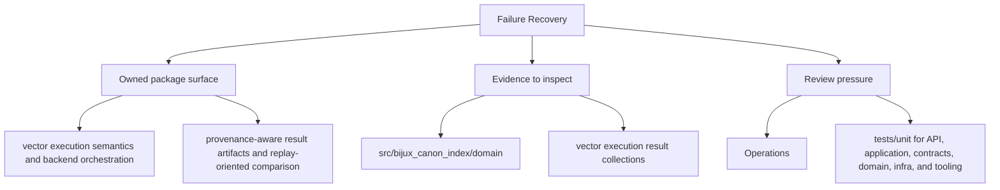

# Failure Recovery

Failure recovery starts with knowing which artifacts, interfaces, and tests expose the problem.

## Page Maps

## Recovery Anchors

- interface surfaces: CLI modules under src/bijux_canon_index/interfaces/cli, HTTP app under src/bijux_canon_index/api, OpenAPI schema files under apis/bijux-canon-index/v1
- artifacts to inspect: vector execution result collections, provenance and replay comparison reports, backend-specific metadata and audit output
- tests to run: tests/unit for API, application, contracts, domain, infra, and tooling, tests/e2e for CLI workflows, API smoke, determinism gates, and provenance gates

## What This Page Answers

- how bijux-canon-index is installed, run, diagnosed, and released
- which files or tests matter during package operation
- where an operator should look when behavior changes

## Purpose

This page gives maintainers a durable frame for triaging package failures.

## Stability

Keep it aligned with the package entrypoints and diagnostic outputs.
