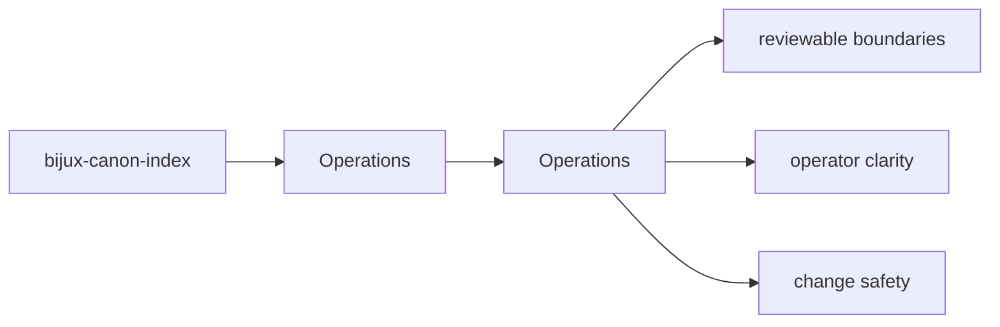
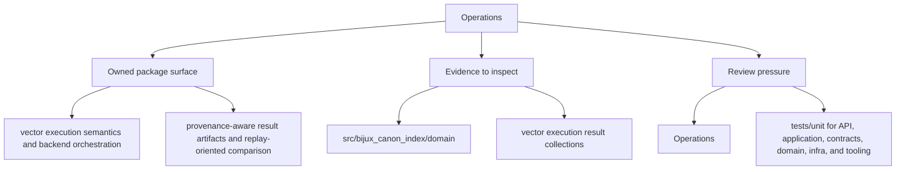

# Operations

bijux-canon-index operations pages describe how to install, run, observe, release, and safely operate the package.

## Page Maps

## Pages in This Section

- [Installation and Setup](installation-and-setup.md)
- [Local Development](local-development.md)
- [Common Workflows](common-workflows.md)
- [Observability and Diagnostics](observability-and-diagnostics.md)
- [Performance and Scaling](performance-and-scaling.md)
- [Failure Recovery](failure-recovery.md)
- [Release and Versioning](release-and-versioning.md)
- [Security and Safety](security-and-safety.md)
- [Deployment Boundaries](deployment-boundaries.md)

## Read Across the Package

- [Foundation](../foundation/index.md)
- [Architecture](../architecture/index.md)
- [Interfaces](../interfaces/index.md)
- [Quality](../quality/index.md)

## Use This Page When

- you are installing, running, diagnosing, or releasing the package
- you need operational anchors rather than conceptual framing
- you are responding to package behavior in a local or CI environment

## What This Page Answers

- how bijux-canon-index is installed, run, diagnosed, and released
- which files or tests matter during package operation
- where an operator should look when behavior changes

## Purpose

This page explains how to use the operations section for `bijux-canon-index` without repeating the detail that belongs on the topic pages beneath it.

## Stability

This page is part of the canonical package docs spine. Keep it aligned with the current package boundary and the topic pages in this section.
