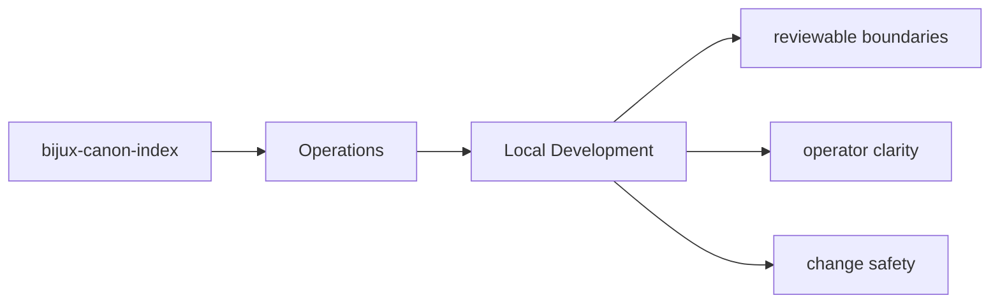
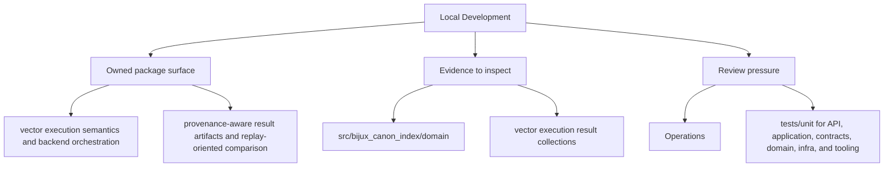

# Local Development

Local development should happen inside `packages/bijux-canon-index` with tests and docs updated
in the same change series as the code.

## Page Maps

## Development Anchors

- tests/unit for API, application, contracts, domain, infra, and tooling
- tests/e2e for CLI workflows, API smoke, determinism gates, and provenance gates
- tests/conformance and tests/compat_v01 for compatibility behavior
- tests/stress and tests/scenarios for operational pressure checks

## What This Page Answers

- how bijux-canon-index is installed, run, diagnosed, and released
- which files or tests matter during package operation
- where an operator should look when behavior changes

## Purpose

This page records the package-local development posture.

## Stability

Keep it aligned with the actual test layout and maintenance workflow.
