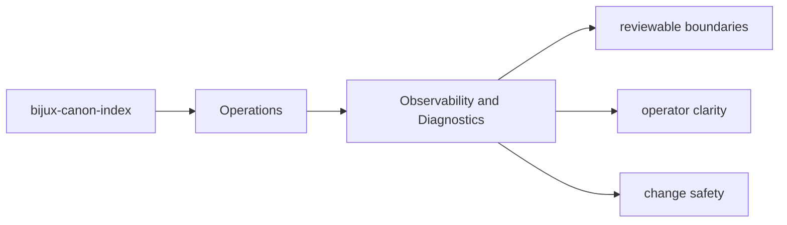
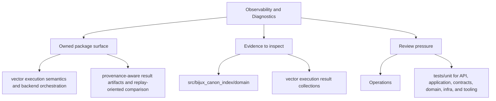

# Observability and Diagnostics

Diagnostics should make it easier to explain what `bijux-canon-index` did, not merely that it ran.

## Page Maps

## Diagnostic Anchors

- vector execution result collections
- provenance and replay comparison reports
- backend-specific metadata and audit output

## Supporting Modules

- `src/bijux_canon_index/domain` for execution, provenance, and request semantics
- `src/bijux_canon_index/application` for workflow coordination

## Use This Page When

- you are installing, running, diagnosing, or releasing the package
- you need operational anchors rather than conceptual framing
- you are responding to package behavior in a local or CI environment

## What This Page Answers

- how bijux-canon-index is installed, run, diagnosed, and released
- which files or tests matter during package operation
- where an operator should look when behavior changes

## Reviewer Lens

- verify that setup, workflow, and release references still match package metadata
- check that operational docs point at current diagnostics and validation paths
- confirm that release-facing claims match the package's actual versioning files

## Honesty Boundary

This page explains how bijux-canon-index is expected to be operated, but it does not replace package metadata, runtime behavior, or validation runs in a real environment.

## Purpose

This page points readers toward the package's observable output and diagnostic support.

## Stability

Keep it aligned with the package modules and artifacts that currently support diagnosis.
