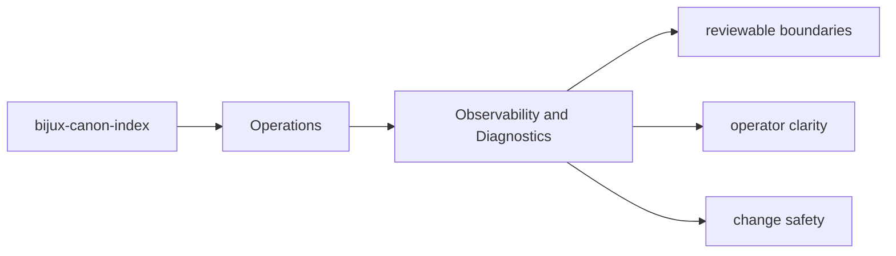

# Observability and Diagnostics

Diagnostics should make it easier to explain what `bijux-canon-index` did, not merely that it ran.

## Page Maps

## Diagnostic Anchors

- vector execution result collections
- provenance and replay comparison reports
- backend-specific metadata and audit output

## Supporting Modules

- `src/bijux_canon_index/domain` for execution, provenance, and request semantics
- `src/bijux_canon_index/application` for workflow coordination

## Purpose

This page points readers toward the package's observable output and diagnostic support.

## Stability

Keep it aligned with the package modules and artifacts that currently support diagnosis.
