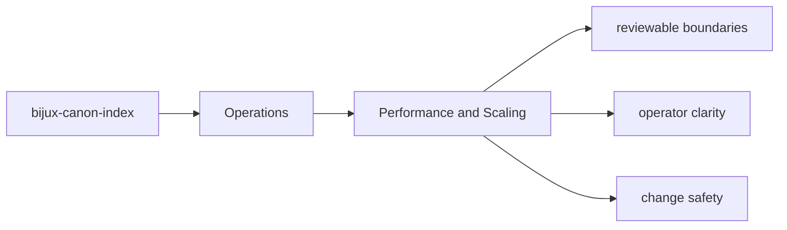
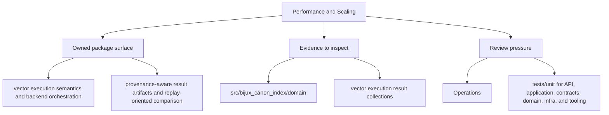

# Performance and Scaling

Performance work should preserve the deterministic and contract-driven behavior the package already promises.

## Page Maps

## Performance Review Anchors

- inspect workflow modules before optimizing boundary code blindly
- use the package tests that exercise realistic workloads
- treat artifact and contract drift as a regression even when performance improves

## Test Anchors

- tests/unit for API, application, contracts, domain, infra, and tooling
- tests/e2e for CLI workflows, API smoke, determinism gates, and provenance gates
- tests/conformance and tests/compat_v01 for compatibility behavior
- tests/stress and tests/scenarios for operational pressure checks

## Concrete Anchors

- `packages/bijux-canon-index/pyproject.toml` for package metadata
- `packages/bijux-canon-index/README.md` for local package framing
- `packages/bijux-canon-index/tests` for executable operational backstops

## Use This Page When

- you are installing, running, diagnosing, or releasing the package
- you need operational anchors rather than conceptual framing
- you are responding to package behavior in a local or CI environment

## What This Page Answers

- how bijux-canon-index is installed, run, diagnosed, and released
- which files or tests matter during package operation
- where an operator should look when behavior changes

## Reviewer Lens

- verify that setup, workflow, and release references still match package metadata
- check that operational docs point at current diagnostics and validation paths
- confirm that release-facing claims match the package's actual versioning files

## Honesty Boundary

This page explains how bijux-canon-index is expected to be operated, but it does not replace package metadata, runtime behavior, or validation runs in a real environment.

## Purpose

This page records the posture for performance work in `bijux-canon-index`.

## Stability

Keep it aligned with the package's actual performance-sensitive paths and validation surfaces.
