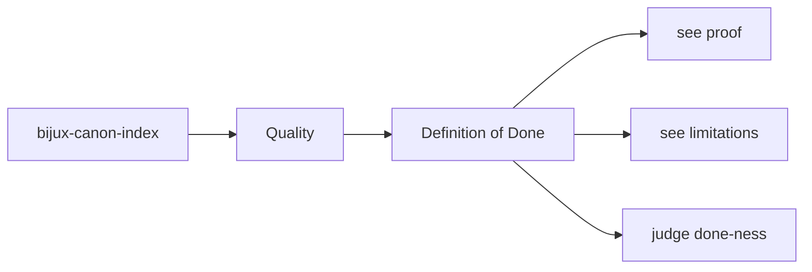
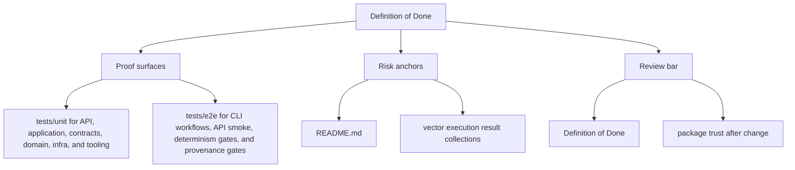

# Definition of Done

A change in `bijux-canon-index` is not done when code passes locally but the package contract
is still unclear or unprotected.

This page is where the package draws the line against false confidence. Done
should mean that behavior, explanation, and proof all move together.

Read the quality pages for `bijux-canon-index` as the proof frame around the package. They should explain how trust is earned, how risk stays visible, and why a passing local check is not always enough.

## Page Maps

## Done Means

- code, docs, and tests agree on the new behavior
- public surfaces and artifacts remain explainable
- release-facing impact is visible when compatibility changes

## Concrete Anchors

- tests/unit for API, application, contracts, domain, infra, and tooling
- tests/e2e for CLI workflows, API smoke, determinism gates, and provenance gates
- README.md

## Use This Page When

- you are reviewing tests, invariants, limitations, or ongoing risks
- you need evidence that the documented contract is actually defended
- you are deciding whether a change is truly done rather than merely implemented

## Decision Rule

Use `Definition of Done` to decide whether `bijux-canon-index` has actually earned trust after a change. If one narrow green check hides a wider contract, risk, or validation gap, the work is not done yet.

## What This Page Answers

- what currently proves the `bijux-canon-index` contract instead of merely describing it
- which risks, limits, and assumptions still need explicit skepticism
- what a reviewer should be able to say before accepting a change as done

## Reviewer Lens

- compare the documented proof story with the actual test layout and release posture
- look for limitations or risks that should have moved with recent behavior changes
- verify that the claimed done-ness standard still reflects real validation practice

## Honesty Boundary

This page explains how `bijux-canon-index` is supposed to earn trust, but it does not claim that prose alone is enough. If the listed tests, checks, and review practice stop backing the story, the story has to change.

## Next Checks

- move to foundation when the risk appears to be boundary confusion rather than missing tests
- move to architecture when the proof gap points to structural drift
- move to interfaces or operations when the proof question is really about a contract or workflow

## Purpose

This page records the package's completion threshold.

## Stability

Keep it aligned with the package validation and release expectations.
