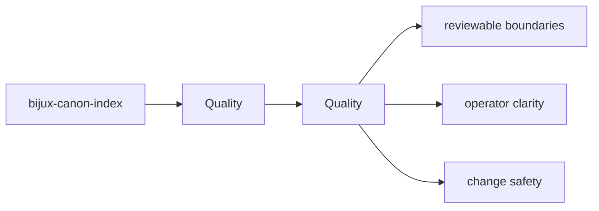
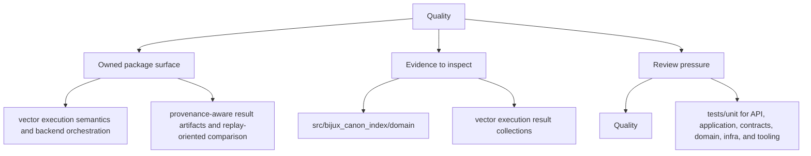

# Quality

bijux-canon-index quality pages describe the tests, invariants, limits, and review rules that keep the package trustworthy over time.

## Page Maps

## Pages in This Section

- [Test Strategy](test-strategy.md)
- [Invariants](invariants.md)
- [Review Checklist](review-checklist.md)
- [Documentation Standards](documentation-standards.md)
- [Definition of Done](definition-of-done.md)
- [Dependency Governance](dependency-governance.md)
- [Change Validation](change-validation.md)
- [Known Limitations](known-limitations.md)
- [Risk Register](risk-register.md)

## Read Across the Package

- [Foundation](../foundation/index.md)
- [Architecture](../architecture/index.md)
- [Interfaces](../interfaces/index.md)
- [Operations](../operations/index.md)

## Concrete Anchors

- tests/unit for API, application, contracts, domain, infra, and tooling
- tests/e2e for CLI workflows, API smoke, determinism gates, and provenance gates
- README.md

## Use This Page When

- you are reviewing tests, invariants, limitations, or risk
- you need evidence that the documented contract is actually protected
- you are deciding whether a change is done rather than merely implemented

## What This Page Answers

- what proves the bijux-canon-index contract today
- which risks or limits still need explicit review
- what a reviewer should verify before accepting change

## Reviewer Lens

- compare the documented proof strategy with the current test layout
- look for limitations or risks that should have been updated by recent changes
- verify that the page's definition of done still reflects real validation practice

## Honesty Boundary

This page explains how bijux-canon-index protects itself, but it does not claim that prose alone is enough without the listed tests, checks, and review practice.

## Section Contract

- define what the quality section covers for bijux-canon-index
- point readers to the topic pages that hold the detailed explanations
- keep the section boundary reviewable as the package evolves

## Reading Advice

- start here when you know the package but not yet the right page inside the section
- use the page list to choose the narrowest topic that matches the current question
- move across sections only after this section stops being the right lens

## Purpose

This page explains how to use the quality section for `bijux-canon-index` without repeating the detail that belongs on the topic pages beneath it.

## Stability

This page is part of the canonical package docs spine. Keep it aligned with the current package boundary and the topic pages in this section.

## Core Claim

The quality claim of `bijux-canon-index` is that tests, invariants, risks, and completion criteria jointly prove whether the package is trustworthy after change.
