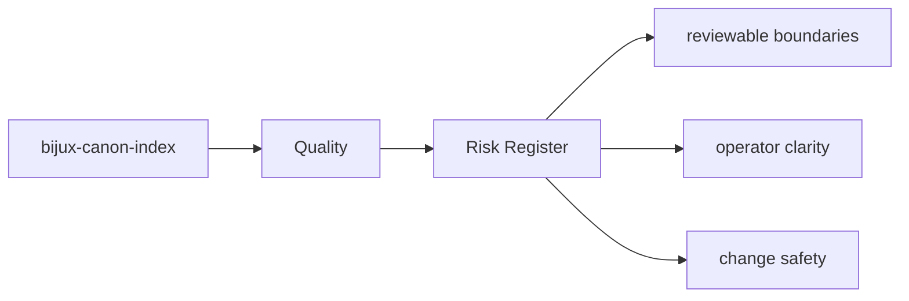

# Risk Register

The durable risks for `bijux-canon-index` are the ones that make the package boundary, interface contract,
or produced artifacts harder to trust.

## Page Maps

## Ongoing Risks to Watch

- hidden overlap with neighboring packages
- drift between docs, code, and tests
- compatibility changes that are not made explicit

## Purpose

This page keeps long-lived package risks visible to maintainers.

## Stability

Update it when the durable risk profile changes, not for routine day-to-day churn.
