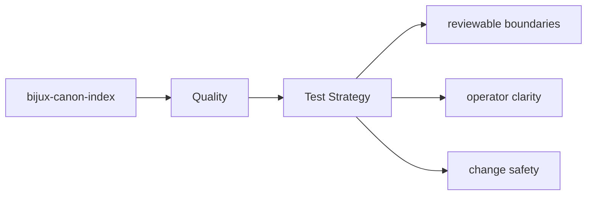
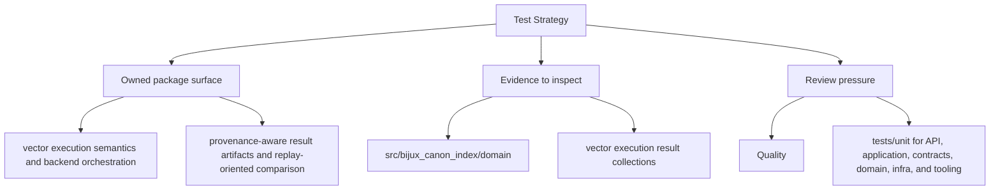

# Test Strategy

The tests for `bijux-canon-index` are the executable proof of its package contract.

## Page Maps

## Test Areas

- tests/unit for API, application, contracts, domain, infra, and tooling
- tests/e2e for CLI workflows, API smoke, determinism gates, and provenance gates
- tests/conformance and tests/compat_v01 for compatibility behavior
- tests/stress and tests/scenarios for operational pressure checks

## Concrete Anchors

- tests/unit for API, application, contracts, domain, infra, and tooling
- tests/e2e for CLI workflows, API smoke, determinism gates, and provenance gates
- README.md

## Use This Page When

- you are reviewing tests, invariants, limitations, or risk
- you need evidence that the documented contract is actually protected
- you are deciding whether a change is done rather than merely implemented

## What This Page Answers

- what proves the bijux-canon-index contract today
- which risks or limits still need explicit review
- what a reviewer should verify before accepting change

## Reviewer Lens

- compare the documented proof strategy with the current test layout
- look for limitations or risks that should have been updated by recent changes
- verify that the page's definition of done still reflects real validation practice

## Honesty Boundary

This page explains how bijux-canon-index protects itself, but it does not claim that prose alone is enough without the listed tests, checks, and review practice.

## Purpose

This page explains the broad testing shape of the package.

## Stability

Keep it aligned with the real test directories and the behaviors they protect.

## Core Claim

The quality claim of `bijux-canon-index` is that tests, invariants, risks, and completion criteria jointly prove whether the package is trustworthy after change.

## Why It Matters

If the quality pages for `bijux-canon-index` are weak, it becomes difficult to tell whether a change is actually safe or merely passes a narrow local test.

## If It Drifts

- reviewers cannot tell whether the listed proof still covers the real risk surface
- limitations stop being visible until they show up as rework later
- definition-of-done language drifts away from actual validation practice

## Representative Scenario

A change appears correct locally, but the reviewer still needs to know whether `bijux-canon-index` has actually satisfied its proof obligations before the work is accepted.

## Source Of Truth Order

- `packages/bijux-canon-index/tests` for executable proof
- `packages/bijux-canon-index/pyproject.toml` for declared package constraints
- this page for the review lens that explains how to read that proof

## Common Misreadings

- that a passing local test automatically satisfies the package review standard
- that documented risks are static and do not need to move with the code
- that the definition of done is only about implementation rather than proof
