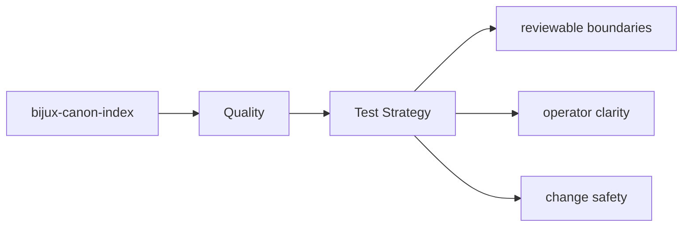

# Test Strategy

The tests for `bijux-canon-index` are the executable proof of its package contract.

## Page Maps

## Test Areas

- tests/unit for API, application, contracts, domain, infra, and tooling
- tests/e2e for CLI workflows, API smoke, determinism gates, and provenance gates
- tests/conformance and tests/compat_v01 for compatibility behavior
- tests/stress and tests/scenarios for operational pressure checks

## Purpose

This page explains the broad testing shape of the package.

## Stability

Keep it aligned with the real test directories and the behaviors they protect.
