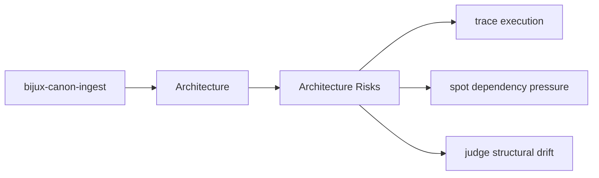
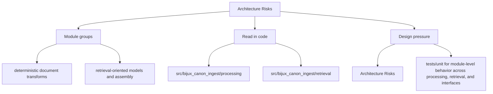

# Architecture Risks

Architectural risk appears when the package boundary becomes hard to explain or hard to test.

This page should keep risk language concrete. The right risks are the ones that
would make the package harder to reason about even if the current implementation
still appears to work.

Read the architecture pages for `bijux-canon-ingest` as a reviewer-facing map of structure and flow. They should shorten code reading, not try to replace it, and they should make drift visible before it becomes surprising.

## Page Maps

## Risk Signals

- behavior moves into the wrong package because it seems convenient
- interfaces start depending on lower-level implementation details directly
- produced artifacts stop matching their documented contract

## Review Areas

- `src/bijux_canon_ingest/processing` for deterministic document transforms
- `src/bijux_canon_ingest/retrieval` for retrieval-oriented models and assembly
- `src/bijux_canon_ingest/application` for package workflows
- `src/bijux_canon_ingest/infra` for local adapters and infrastructure helpers
- `src/bijux_canon_ingest/interfaces` for CLI and HTTP boundaries
- `src/bijux_canon_ingest/safeguards` for protective rules for ingest behavior

## Concrete Anchors

- `src/bijux_canon_ingest/processing` for deterministic document transforms
- `src/bijux_canon_ingest/retrieval` for retrieval-oriented models and assembly
- `src/bijux_canon_ingest/application` for package workflows

## Use This Page When

- you are tracing structure, execution flow, or dependency pressure
- you need to understand how modules fit before refactoring
- you are reviewing design drift rather than one isolated bug

## Decision Rule

Use `Architecture Risks` to decide whether a structural change makes `bijux-canon-ingest` easier or harder to explain in terms of modules, dependency direction, and execution flow. If the change works only because the design becomes harder to read, the safer answer is redesign rather than acceptance.

## What This Page Answers

- how `bijux-canon-ingest` is organized internally in terms a reviewer can follow
- which modules carry the main execution and dependency story
- where structural drift would show up before it becomes expensive

## Reviewer Lens

- trace the described execution path through the named modules instead of trusting the diagram alone
- look for dependency direction or layering that now contradicts the documented seam
- verify that the structural risks named here still match the current code shape

## Honesty Boundary

This page describes the current structural model of `bijux-canon-ingest`, but it does not guarantee that every import path or runtime path still obeys that model. Readers should treat it as a map that must stay aligned with code and tests, not as an authority above them.

## Next Checks

- move to interfaces when the review reaches a public or operator-facing seam
- move to operations when the concern becomes repeatable runtime behavior
- move to quality when you need proof that the documented structure is still protected

## Purpose

This page keeps architectural review focused on durable package risks instead of transient churn.

## Stability

Keep it aligned with the package structure and known review concerns.
