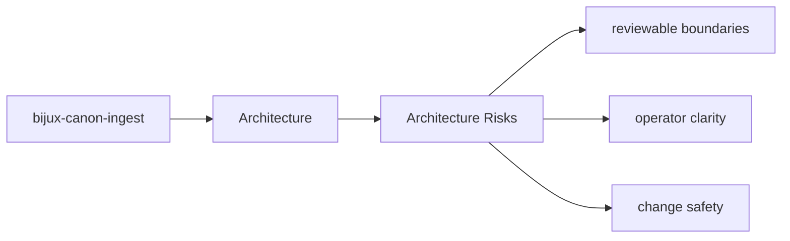

# Architecture Risks

Architectural risk appears when the package boundary becomes hard to explain or hard to test.

## Page Maps

## Risk Signals

- behavior moves into the wrong package because it seems convenient
- interfaces start depending on lower-level implementation details directly
- produced artifacts stop matching their documented contract

## Review Areas

- `src/bijux_canon_ingest/processing` for deterministic document transforms
- `src/bijux_canon_ingest/retrieval` for retrieval-oriented models and assembly
- `src/bijux_canon_ingest/application` for package workflows
- `src/bijux_canon_ingest/infra` for local adapters and infrastructure helpers
- `src/bijux_canon_ingest/interfaces` for CLI and HTTP boundaries
- `src/bijux_canon_ingest/safeguards` for protective rules for ingest behavior

## Purpose

This page keeps architectural review focused on durable package risks instead of transient churn.

## Stability

Keep it aligned with the package structure and known review concerns.
