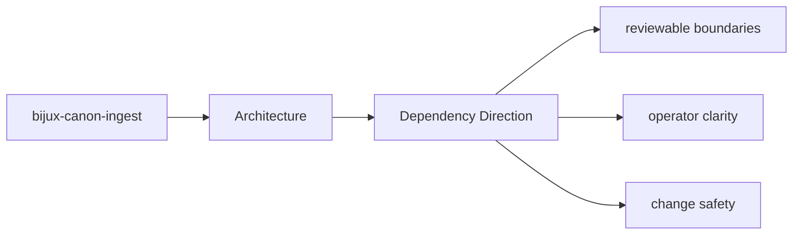

# Dependency Direction

The package should keep dependency direction readable: domain intent near the center,
interfaces and infrastructure at the edges.

## Page Maps

## Directional Reading Order

- domain and model concerns under the core module groups
- application orchestration that composes domain behavior
- interfaces, APIs, and adapters that sit at the boundary

## Concrete Anchors

- `src/bijux_canon_ingest/processing` for deterministic document transforms
- `src/bijux_canon_ingest/retrieval` for retrieval-oriented models and assembly
- `src/bijux_canon_ingest/application` for package workflows
- `src/bijux_canon_ingest/infra` for local adapters and infrastructure helpers
- `src/bijux_canon_ingest/interfaces` for CLI and HTTP boundaries
- `src/bijux_canon_ingest/safeguards` for protective rules for ingest behavior

## Purpose

This page makes dependency direction explicit enough to review during refactors.

## Stability

Keep it aligned with current imports and directory responsibilities.
