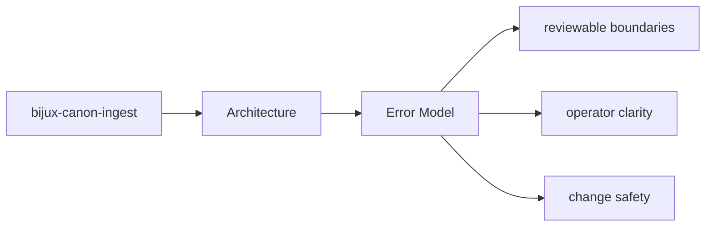
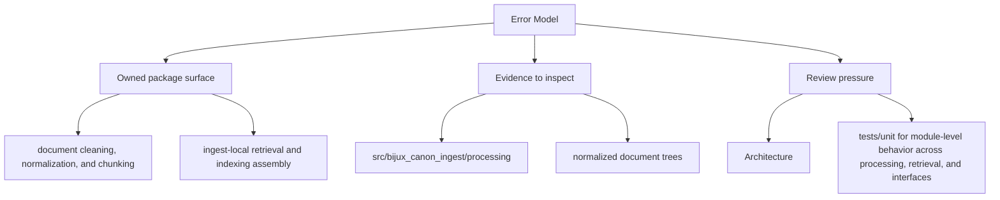

# Error Model

The package error model should make it clear which failures are local validation issues,
which are dependency failures, and which are contract violations.

## Page Maps

## Review Anchors

- inspect interface modules for operator-facing error shape
- inspect application and domain modules for orchestration failures
- inspect tests for the failure cases the package already protects

## Test Areas

- tests/unit for module-level behavior across processing, retrieval, and interfaces
- tests/e2e for package boundary coverage
- tests/invariants for long-lived repository promises
- tests/eval for corpus-backed behavior checks

## Purpose

This page records how to reason about failures in architecture review.

## Stability

Keep it aligned with the actual error-handling behavior and tests.
