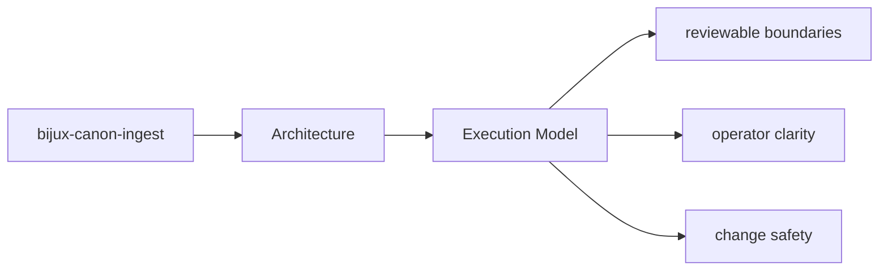
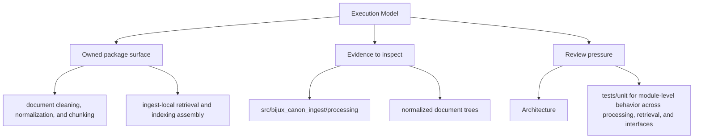

# Execution Model

`bijux-canon-ingest` executes work by receiving inputs at its interfaces, coordinating policy
and workflows in application code, and delegating specific responsibilities to owned modules.

## Page Maps

## Execution Anchors

- entry surfaces: CLI entrypoint in src/bijux_canon_ingest/interfaces/cli/entrypoint.py, HTTP boundaries under src/bijux_canon_ingest/interfaces, configuration modules under src/bijux_canon_ingest/config
- workflow modules: src/bijux_canon_ingest/processing, src/bijux_canon_ingest/retrieval, src/bijux_canon_ingest/application
- outputs: normalized document trees, chunk collections and retrieval-ready records, diagnostic output produced during ingest workflows

## Concrete Anchors

- `src/bijux_canon_ingest/processing` for deterministic document transforms
- `src/bijux_canon_ingest/retrieval` for retrieval-oriented models and assembly
- `src/bijux_canon_ingest/application` for package workflows

## Use This Page When

- you are tracing internal structure or execution flow
- you need to understand where modules fit before refactoring
- you are reviewing architectural drift instead of one local bug

## What This Page Answers

- how bijux-canon-ingest is structured internally
- which modules control the main execution path
- where architectural drift would become visible first

## Reviewer Lens

- trace the claimed execution path through the listed modules
- look for dependency direction that now contradicts the documented seam
- verify that architectural risks still match the current code structure

## Honesty Boundary

This page describes the current structural model of bijux-canon-ingest, but it does not by itself prove that every import or runtime path still obeys that model.

## Purpose

This page summarizes the package execution model before readers inspect individual modules.

## Stability

Keep it aligned with the actual workflow code and entrypoints.

## Core Claim

The architectural claim of `bijux-canon-ingest` is that its structure is deliberate enough for a reviewer to trace responsibilities, dependencies, and drift pressure without reverse-engineering the entire codebase.

## Why It Matters

If the architecture pages for `bijux-canon-ingest` are weak, refactors become guesswork and dependency drift can hide until failures show up in tests or production-facing behavior.
