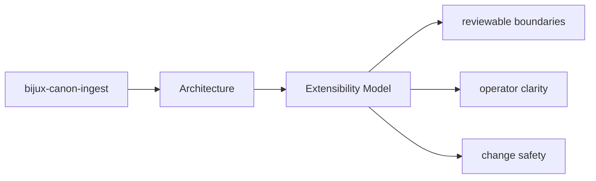
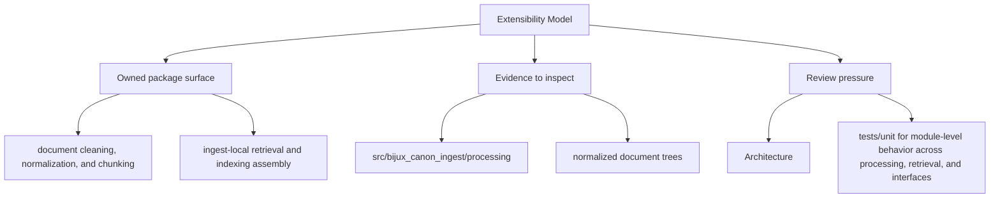

# Extensibility Model

Extension work should use the package seams that already exist instead of bypassing ownership.

## Page Maps

## Likely Extension Areas

- `src/bijux_canon_ingest/processing` for deterministic document transforms
- `src/bijux_canon_ingest/retrieval` for retrieval-oriented models and assembly
- `src/bijux_canon_ingest/application` for package workflows
- `src/bijux_canon_ingest/infra` for local adapters and infrastructure helpers
- `src/bijux_canon_ingest/interfaces` for CLI and HTTP boundaries
- `src/bijux_canon_ingest/safeguards` for protective rules for ingest behavior

## Extension Rule

Add extension points where the package already expects variation, and document them next to the owning boundary.

## Concrete Anchors

- `src/bijux_canon_ingest/processing` for deterministic document transforms
- `src/bijux_canon_ingest/retrieval` for retrieval-oriented models and assembly
- `src/bijux_canon_ingest/application` for package workflows

## Use This Page When

- you are tracing internal structure or execution flow
- you need to understand where modules fit before refactoring
- you are reviewing architectural drift instead of one local bug

## What This Page Answers

- how bijux-canon-ingest is structured internally
- which modules control the main execution path
- where architectural drift would become visible first

## Reviewer Lens

- trace the claimed execution path through the listed modules
- look for dependency direction that now contradicts the documented seam
- verify that architectural risks still match the current code structure

## Honesty Boundary

This page describes the current structural model of bijux-canon-ingest, but it does not by itself prove that every import or runtime path still obeys that model.

## Purpose

This page helps maintainers extend the package without smearing responsibilities together.

## Stability

Keep it aligned with the package seams that actually support extension today.

## Core Claim

The architectural claim of `bijux-canon-ingest` is that its structure is deliberate enough for a reviewer to trace responsibilities, dependencies, and drift pressure without reverse-engineering the entire codebase.

## Why It Matters

If the architecture pages for `bijux-canon-ingest` are weak, refactors become guesswork and dependency drift can hide until failures show up in tests or production-facing behavior.

## If It Drifts

- dependency direction becomes harder to inspect quickly
- refactors can land without anyone noticing structural regressions until later
- code navigation becomes slower because the documented map no longer matches reality
