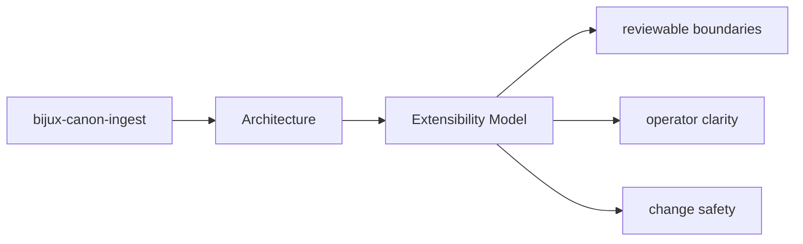

# Extensibility Model

Extension work should use the package seams that already exist instead of bypassing ownership.

## Page Maps

## Likely Extension Areas

- `src/bijux_canon_ingest/processing` for deterministic document transforms
- `src/bijux_canon_ingest/retrieval` for retrieval-oriented models and assembly
- `src/bijux_canon_ingest/application` for package workflows
- `src/bijux_canon_ingest/infra` for local adapters and infrastructure helpers
- `src/bijux_canon_ingest/interfaces` for CLI and HTTP boundaries
- `src/bijux_canon_ingest/safeguards` for protective rules for ingest behavior

## Extension Rule

Add extension points where the package already expects variation, and document them next to the owning boundary.

## Purpose

This page helps maintainers extend the package without smearing responsibilities together.

## Stability

Keep it aligned with the package seams that actually support extension today.
