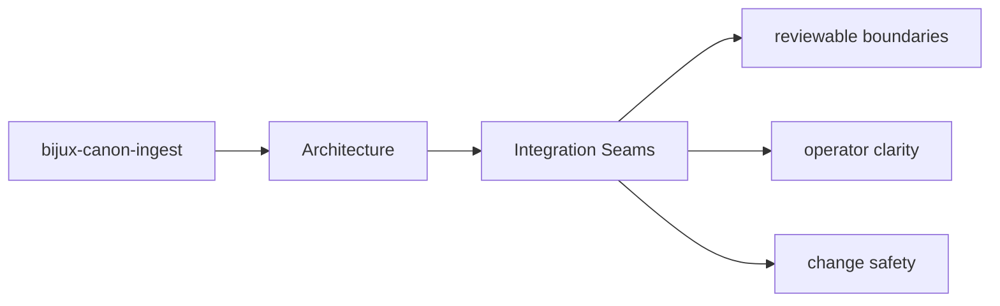

# Integration Seams

Integration seams are the points where `bijux-canon-ingest` meets configuration, APIs,
operators, or neighboring packages.

## Page Maps

## Integration Surfaces

- CLI entrypoint in src/bijux_canon_ingest/interfaces/cli/entrypoint.py
- HTTP boundaries under src/bijux_canon_ingest/interfaces
- configuration modules under src/bijux_canon_ingest/config

## Adjacent Systems

- feeds prepared material toward bijux-canon-index and bijux-canon-reason
- stays under runtime governance instead of defining replay authority itself

## Purpose

This page explains where to look when integration behavior changes.

## Stability

Keep it aligned with real boundary modules and schema files.
