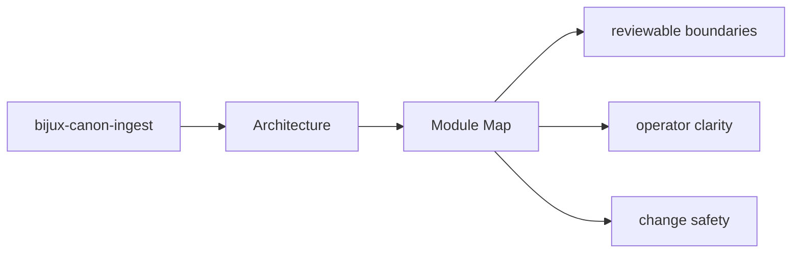
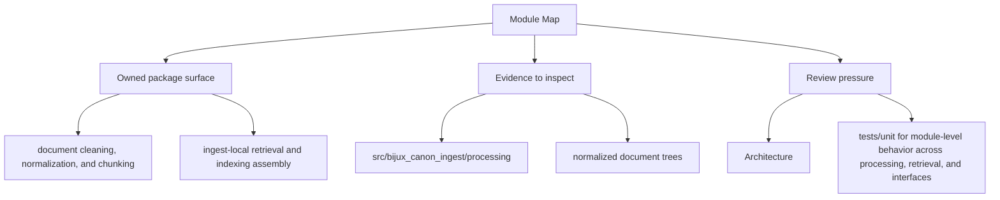

# Module Map

The architecture of `bijux-canon-ingest` is easiest to understand from the major module groups.

## Page Maps

## Major Modules

- `src/bijux_canon_ingest/processing` for deterministic document transforms
- `src/bijux_canon_ingest/retrieval` for retrieval-oriented models and assembly
- `src/bijux_canon_ingest/application` for package workflows
- `src/bijux_canon_ingest/infra` for local adapters and infrastructure helpers
- `src/bijux_canon_ingest/interfaces` for CLI and HTTP boundaries
- `src/bijux_canon_ingest/safeguards` for protective rules for ingest behavior

## What This Page Answers

- how bijux-canon-ingest is structured internally
- which modules control the main execution path
- where architectural drift would become visible first

## Purpose

This page provides a shortest-path code map for the package.

## Stability

Keep it aligned with the actual source directories under `packages/bijux-canon-ingest`.
