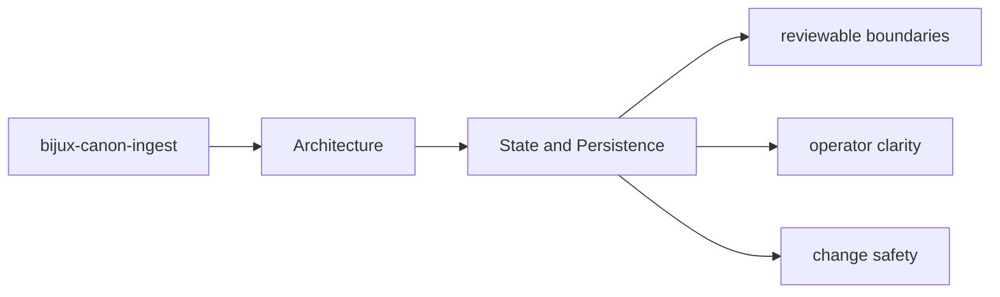

# State and Persistence

State in `bijux-canon-ingest` should be explicit enough that a maintainer can say what is
transient, what is serialized, and what neighboring packages must not assume.

## Page Maps

## Durable Surfaces

- normalized document trees
- chunk collections and retrieval-ready records
- diagnostic output produced during ingest workflows

## Code Areas to Inspect

- `src/bijux_canon_ingest/processing` for deterministic document transforms
- `src/bijux_canon_ingest/retrieval` for retrieval-oriented models and assembly
- `src/bijux_canon_ingest/application` for package workflows
- `src/bijux_canon_ingest/infra` for local adapters and infrastructure helpers
- `src/bijux_canon_ingest/interfaces` for CLI and HTTP boundaries
- `src/bijux_canon_ingest/safeguards` for protective rules for ingest behavior

## Purpose

This page marks the package's state and artifact boundary.

## Stability

Keep it aligned with the actual artifact shapes and serialized outputs.
