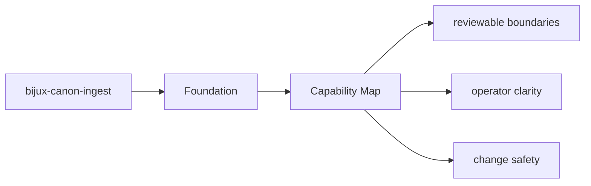

# Capability Map

The package capabilities can be read as a map from modules to behavior.

## Page Maps

## Capability Map

- `src/bijux_canon_ingest/processing` for deterministic document transforms
- `src/bijux_canon_ingest/retrieval` for retrieval-oriented models and assembly
- `src/bijux_canon_ingest/application` for package workflows
- `src/bijux_canon_ingest/infra` for local adapters and infrastructure helpers
- `src/bijux_canon_ingest/interfaces` for CLI and HTTP boundaries
- `src/bijux_canon_ingest/safeguards` for protective rules for ingest behavior

## Produced Artifacts

- normalized document trees
- chunk collections and retrieval-ready records
- diagnostic output produced during ingest workflows

## Purpose

This page helps a reader quickly map package claims to code areas.

## Stability

Keep it aligned with the real package modules and generated outputs.
