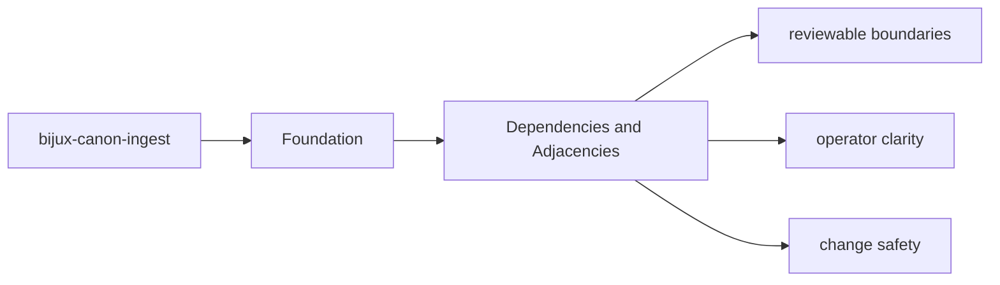

# Dependencies and Adjacencies

Package dependencies matter because they reveal which behavior is local and which behavior is delegated.

## Page Maps

## Direct Dependency Themes

- pydantic
- msgpack
- numpy
- fastapi
- uvicorn
- PyYAML

## Adjacent Package Relationships

- feeds prepared material toward bijux-canon-index and bijux-canon-reason
- stays under runtime governance instead of defining replay authority itself

## Purpose

This page explains which surrounding tools and packages `bijux-canon-ingest` depends on to do its job.

## Stability

Keep it aligned with `pyproject.toml` and the actual package seams.
