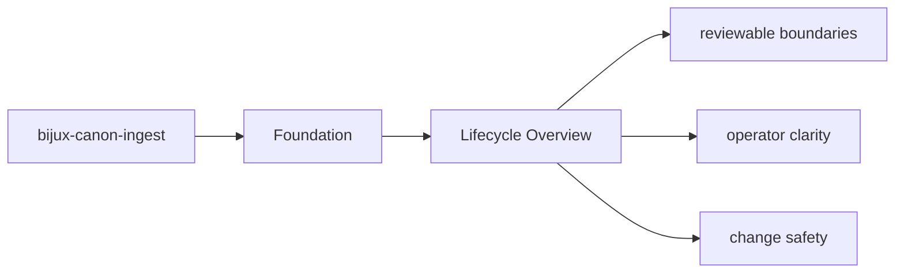

# Lifecycle Overview

Every package run follows a simple lifecycle: inputs enter through interfaces, domain and
application code coordinate the work, and durable artifacts or responses leave the package.

## Page Maps

## Lifecycle Anchors

- entry surfaces: CLI entrypoint in src/bijux_canon_ingest/interfaces/cli/entrypoint.py, HTTP boundaries under src/bijux_canon_ingest/interfaces, configuration modules under src/bijux_canon_ingest/config
- code ownership: src/bijux_canon_ingest/processing, src/bijux_canon_ingest/retrieval, src/bijux_canon_ingest/application
- durable outputs: normalized document trees, chunk collections and retrieval-ready records, diagnostic output produced during ingest workflows

## Purpose

This page keeps the package lifecycle readable before a reader dives into implementation detail.

## Stability

Keep it aligned with the current entrypoints and produced outputs.
