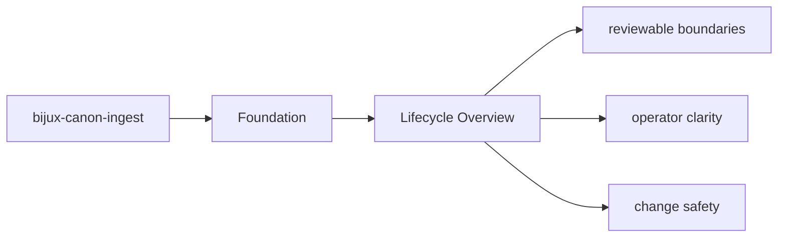
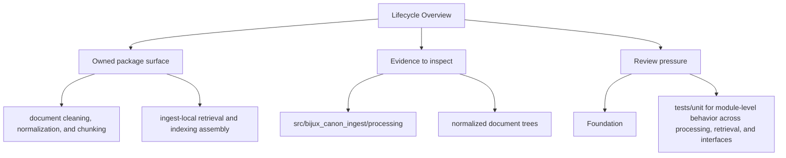

# Lifecycle Overview

Every package run follows a simple lifecycle: inputs enter through interfaces, domain and
application code coordinate the work, and durable artifacts or responses leave the package.

## Page Maps

## Lifecycle Anchors

- entry surfaces: CLI entrypoint in src/bijux_canon_ingest/interfaces/cli/entrypoint.py, HTTP boundaries under src/bijux_canon_ingest/interfaces, configuration modules under src/bijux_canon_ingest/config
- code ownership: src/bijux_canon_ingest/processing, src/bijux_canon_ingest/retrieval, src/bijux_canon_ingest/application
- durable outputs: normalized document trees, chunk collections and retrieval-ready records, diagnostic output produced during ingest workflows

## Concrete Anchors

- `packages/bijux-canon-ingest` as the package root
- `packages/bijux-canon-ingest/src/bijux_canon_ingest` as the import boundary
- `packages/bijux-canon-ingest/tests` as the package proof surface

## Use This Page When

- you need the package boundary before reading implementation detail
- you are deciding whether work belongs in this package or a neighboring one
- you need the shortest stable description of package intent

## What This Page Answers

- what bijux-canon-ingest is expected to own
- what remains outside the package boundary
- which neighboring seams a reviewer should compare next

## Reviewer Lens

- compare the stated package boundary with the owned modules and tests
- check that out-of-scope work is not quietly reintroduced through adjacent packages
- confirm that the package description still matches the real repository layout

## Honesty Boundary

This page can explain the intended boundary of bijux-canon-ingest, but it does not replace the code and tests that ultimately prove that boundary.

## Purpose

This page keeps the package lifecycle readable before a reader dives into implementation detail.

## Stability

Keep it aligned with the current entrypoints and produced outputs.

## Core Claim

The foundational claim of `bijux-canon-ingest` is that its package boundary can be explained in stable ownership terms instead of by implementation accident.

## Why It Matters

If the foundation pages for `bijux-canon-ingest` are weak, reviewers stop knowing where the package boundary really is and adjacent packages begin absorbing behavior by convenience instead of design.
