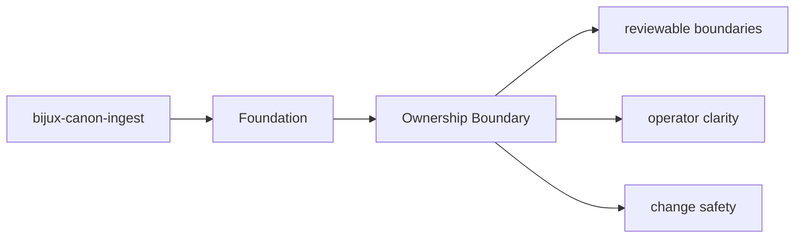

# Ownership Boundary

Ownership in `bijux-canon-ingest` is easiest to read from the source tree plus the tests that protect it.

## Page Maps

## Owned Code Areas

- `src/bijux_canon_ingest/processing` for deterministic document transforms
- `src/bijux_canon_ingest/retrieval` for retrieval-oriented models and assembly
- `src/bijux_canon_ingest/application` for package workflows
- `src/bijux_canon_ingest/infra` for local adapters and infrastructure helpers
- `src/bijux_canon_ingest/interfaces` for CLI and HTTP boundaries
- `src/bijux_canon_ingest/safeguards` for protective rules for ingest behavior

## Adjacent Systems

- feeds prepared material toward bijux-canon-index and bijux-canon-reason
- stays under runtime governance instead of defining replay authority itself

## Purpose

This page ties package ownership to concrete directories instead of abstract slogans.

## Stability

Keep it aligned with the current module layout.
