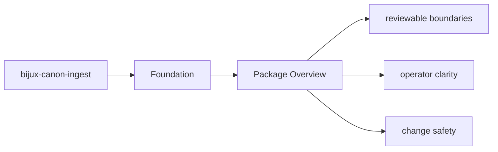

# Package Overview

`bijux-canon-ingest` is the package that owns deterministic document ingestion, chunking, retrieval assembly, and ingest-facing boundaries.

## Page Maps

## What It Owns

- document cleaning, normalization, and chunking
- ingest-local retrieval and indexing assembly
- package-local CLI and HTTP boundaries
- ingest-specific safeguards, adapters, and observability helpers

## What It Does Not Own

- runtime-wide replay authority and persistence
- cross-package vector execution semantics
- repository maintenance automation

## Purpose

This page gives the shortest honest description of what the package is for.

## Stability

Keep it aligned with the real package boundary described by the code and tests.
