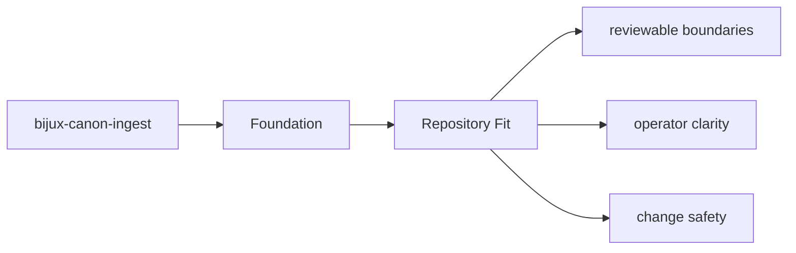

# Repository Fit

`bijux-canon-ingest` sits inside the monorepo as one publishable package with its own `src/`,
tests, metadata, and release history.

## Page Maps

## Repository Relationships

- feeds prepared material toward bijux-canon-index and bijux-canon-reason
- stays under runtime governance instead of defining replay authority itself

## Canonical Package Root

- `packages/bijux-canon-ingest`
- `packages/bijux-canon-ingest/src/bijux_canon_ingest`
- `packages/bijux-canon-ingest/tests`

## Purpose

This page explains how the package fits into the repository without restating repository-wide rules.

## Stability

Keep it aligned with the package's checked-in directories and actual neighboring packages.
