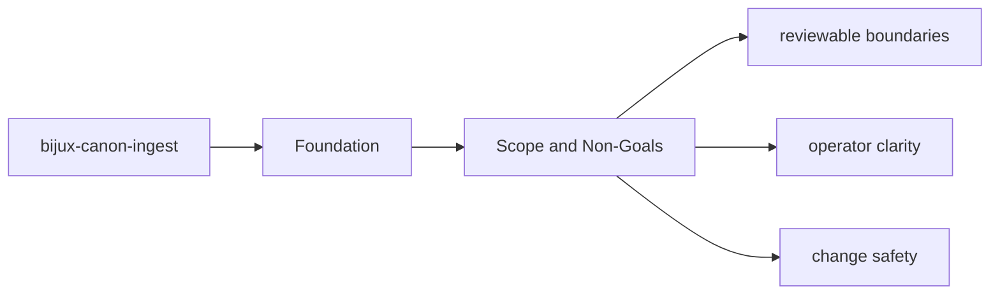
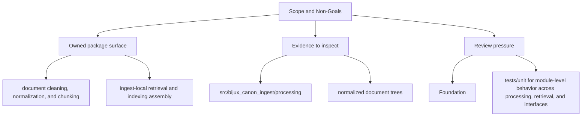

# Scope and Non-Goals

The package boundary exists so neighboring packages can evolve without hidden overlap.

## Page Maps

## In Scope

- document cleaning, normalization, and chunking
- ingest-local retrieval and indexing assembly
- package-local CLI and HTTP boundaries
- ingest-specific safeguards, adapters, and observability helpers

## Out of Scope

- runtime-wide replay authority and persistence
- cross-package vector execution semantics
- repository maintenance automation

## Concrete Anchors

- `packages/bijux-canon-ingest` as the package root
- `packages/bijux-canon-ingest/src/bijux_canon_ingest` as the import boundary
- `packages/bijux-canon-ingest/tests` as the package proof surface

## Use This Page When

- you need the package boundary before reading implementation detail
- you are deciding whether work belongs in this package or a neighboring one
- you need the shortest stable description of package intent

## What This Page Answers

- what bijux-canon-ingest is expected to own
- what remains outside the package boundary
- which neighboring seams a reviewer should compare next

## Reviewer Lens

- compare the stated package boundary with the owned modules and tests
- check that out-of-scope work is not quietly reintroduced through adjacent packages
- confirm that the package description still matches the real repository layout

## Honesty Boundary

This page can explain the intended boundary of bijux-canon-ingest, but it does not replace the code and tests that ultimately prove that boundary.

## Purpose

This page keeps future work from leaking into the wrong package.

## Stability

Update it only when ownership truly moves into or out of `bijux-canon-ingest`.

## Core Claim

The foundational claim of `bijux-canon-ingest` is that its package boundary can be explained in stable ownership terms instead of by implementation accident.

## Why It Matters

If the foundation pages for `bijux-canon-ingest` are weak, reviewers stop knowing where the package boundary really is and adjacent packages begin absorbing behavior by convenience instead of design.

## If It Drifts

- ownership starts migrating by convenience instead of by explicit package boundary
- neighboring packages inherit responsibilities without deliberate review
- reviewers lose confidence that the package description still means anything stable

## Representative Scenario

A contributor proposes moving new behavior into `bijux-canon-ingest` because it is nearby in the repository. This page should make it obvious whether that work fits the package boundary or belongs in a neighboring package instead.

## Source Of Truth Order

- `packages/bijux-canon-ingest/src/bijux_canon_ingest` for the real ownership boundary in code
- `packages/bijux-canon-ingest/tests` for executable proof of that boundary
- `packages/bijux-canon-ingest/README.md` and this section for the shortest maintained framing
