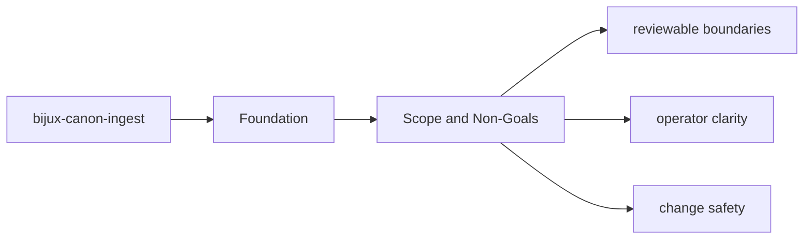
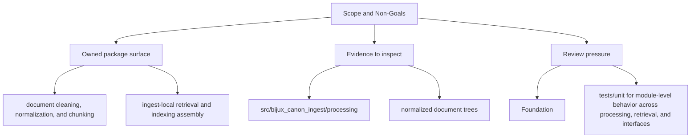

# Scope and Non-Goals

The package boundary exists so neighboring packages can evolve without hidden overlap.

## Page Maps

## In Scope

- document cleaning, normalization, and chunking
- ingest-local retrieval and indexing assembly
- package-local CLI and HTTP boundaries
- ingest-specific safeguards, adapters, and observability helpers

## Out of Scope

- runtime-wide replay authority and persistence
- cross-package vector execution semantics
- repository maintenance automation

## What This Page Answers

- what bijux-canon-ingest is expected to own
- what remains outside the package boundary
- which neighboring seams a reviewer should compare next

## Purpose

This page keeps future work from leaking into the wrong package.

## Stability

Update it only when ownership truly moves into or out of `bijux-canon-ingest`.
