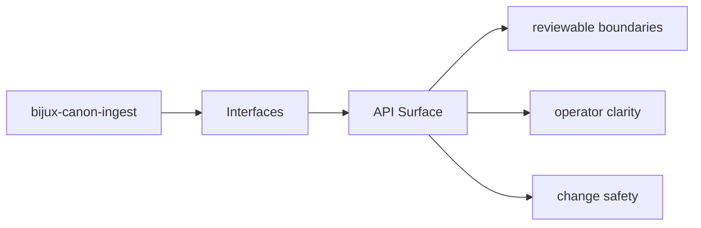
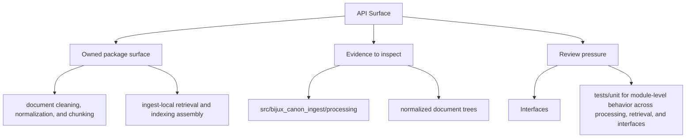

# API Surface

HTTP-facing behavior should be discoverable from tracked schema files and the owning API modules.

## Page Maps

## API Artifacts

- apis/bijux-canon-ingest/v1/schema.yaml

## Boundary Modules

- CLI entrypoint in src/bijux_canon_ingest/interfaces/cli/entrypoint.py
- HTTP boundaries under src/bijux_canon_ingest/interfaces
- configuration modules under src/bijux_canon_ingest/config

## What This Page Answers

- which public or operator-facing surfaces bijux-canon-ingest exposes
- which artifacts and schemas act like contracts
- what compatibility pressure this surface creates

## Purpose

This page ties API behavior to tracked code and schema assets.

## Stability

Keep it aligned with the actual API modules and schema files.
