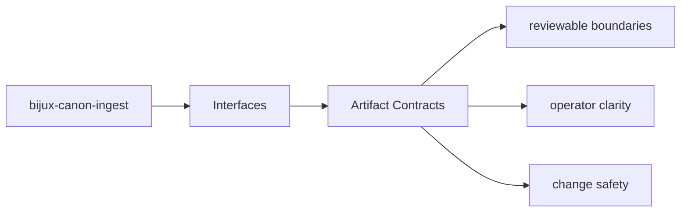
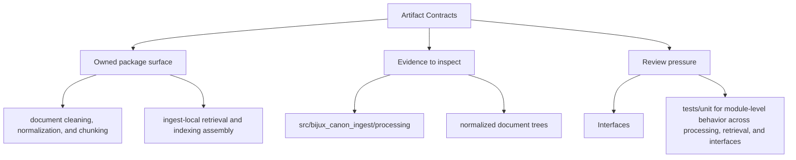

# Artifact Contracts

Produced artifacts are part of the package contract whenever another package, operator,
or replay workflow depends on them.

## Page Maps

## Current Artifacts

- normalized document trees
- chunk collections and retrieval-ready records
- diagnostic output produced during ingest workflows

## What This Page Answers

- which public or operator-facing surfaces bijux-canon-ingest exposes
- which artifacts and schemas act like contracts
- what compatibility pressure this surface creates

## Purpose

This page marks which outputs need stable review when behavior changes.

## Stability

Keep it aligned with the package outputs that are actually produced and consumed.
