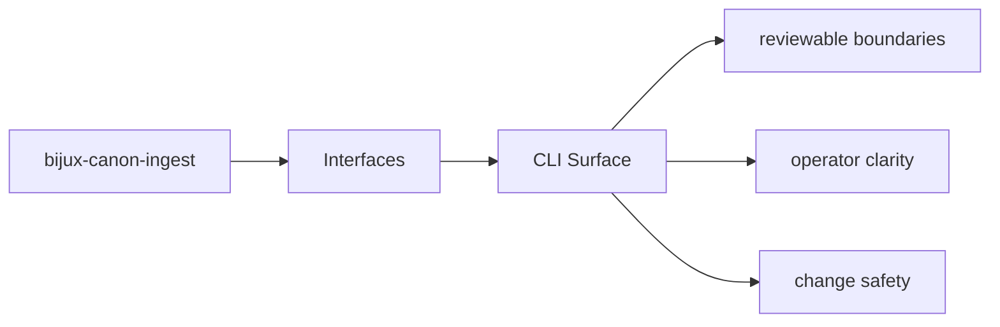

# CLI Surface

The CLI surface is the operator-facing command layer for `bijux-canon-ingest`.

## Page Maps

## Command Facts

- canonical command: `bijux-canon-ingest`
- interface modules: CLI entrypoint in src/bijux_canon_ingest/interfaces/cli/entrypoint.py, HTTP boundaries under src/bijux_canon_ingest/interfaces, configuration modules under src/bijux_canon_ingest/config

## Purpose

This page points maintainers toward the command entrypoints and their owning code.

## Stability

Keep it aligned with the declared scripts and the interface modules that implement them.
