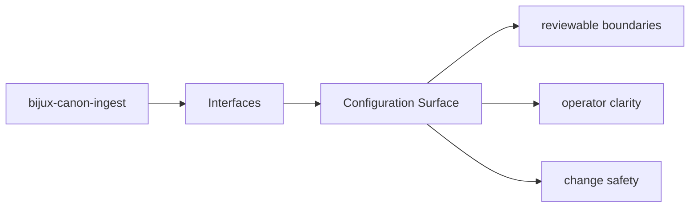
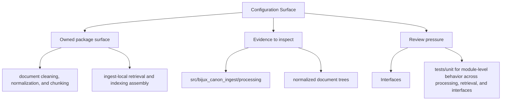

# Configuration Surface

Configuration belongs at the package boundary, not scattered through unrelated modules.

## Page Maps

## Configuration Anchors

- CLI entrypoint in src/bijux_canon_ingest/interfaces/cli/entrypoint.py
- HTTP boundaries under src/bijux_canon_ingest/interfaces
- configuration modules under src/bijux_canon_ingest/config

## Review Rule

Configuration changes should update the operator docs, schema docs, and tests that protect the same behavior.

## What This Page Answers

- which public or operator-facing surfaces bijux-canon-ingest exposes
- which artifacts and schemas act like contracts
- what compatibility pressure this surface creates

## Purpose

This page explains where configuration enters the package and how it should be reviewed.

## Stability

Keep it aligned with real configuration loaders, defaults, and operator-facing options.
