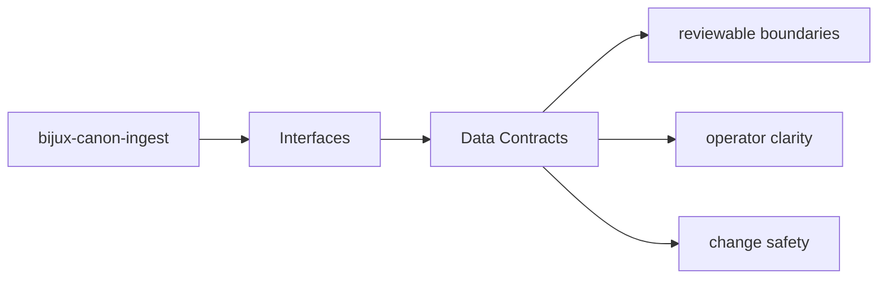

# Data Contracts

Data contracts in `bijux-canon-ingest` include schemas, structured models, and any stable
payload shape that neighboring systems are expected to understand.

## Page Maps

## Contract Anchors

- apis/bijux-canon-ingest/v1/schema.yaml

## Artifact Anchors

- normalized document trees
- chunk collections and retrieval-ready records
- diagnostic output produced during ingest workflows

## Purpose

This page explains which structured shapes deserve compatibility review.

## Stability

Keep it aligned with tracked schemas, stable models, and durable artifacts.
