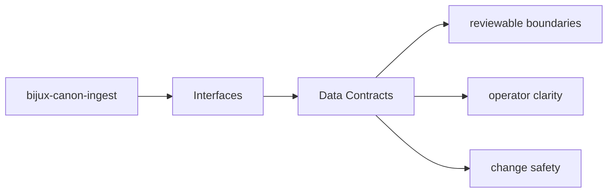
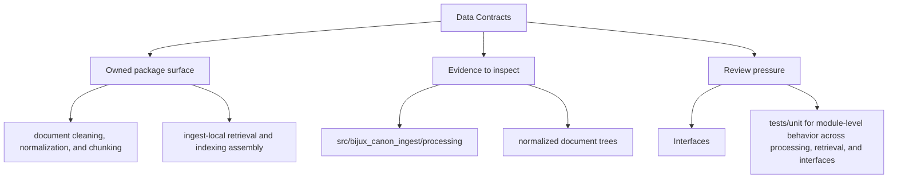

# Data Contracts

Data contracts in `bijux-canon-ingest` include schemas, structured models, and any stable
payload shape that neighboring systems are expected to understand.

## Page Maps

## Contract Anchors

- apis/bijux-canon-ingest/v1/schema.yaml

## Artifact Anchors

- normalized document trees
- chunk collections and retrieval-ready records
- diagnostic output produced during ingest workflows

## Concrete Anchors

- CLI entrypoint in src/bijux_canon_ingest/interfaces/cli/entrypoint.py
- HTTP boundaries under src/bijux_canon_ingest/interfaces
- configuration modules under src/bijux_canon_ingest/config
- apis/bijux-canon-ingest/v1/schema.yaml

## Use This Page When

- you need the public command, API, import, or artifact surface
- you are checking whether a caller can rely on a given shape or entrypoint
- you need the contract-facing side of the package before using it

## What This Page Answers

- which public or operator-facing surfaces bijux-canon-ingest exposes
- which artifacts and schemas act like contracts
- what compatibility pressure this surface creates

## Reviewer Lens

- compare commands, API files, imports, and artifacts against the documented surface
- check whether schema or artifact changes need compatibility review
- confirm that operator-facing examples still point at real entrypoints

## Honesty Boundary

This page can identify the intended public surfaces of bijux-canon-ingest, but real compatibility still depends on code, schemas, artifacts, and tests staying aligned.

## Purpose

This page explains which structured shapes deserve compatibility review.

## Stability

Keep it aligned with tracked schemas, stable models, and durable artifacts.

## Core Claim

The interface claim of `bijux-canon-ingest` is that commands, APIs, imports, schemas, and artifacts form a reviewable contract rather than an implied one.
