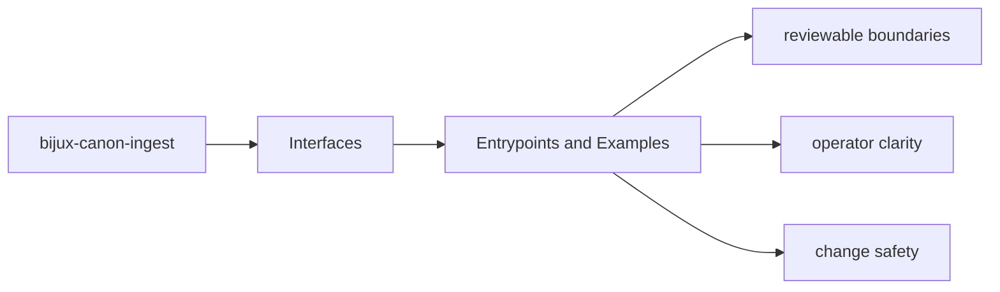

# Entrypoints and Examples

The fastest way to understand the package interfaces is to pair entrypoints with concrete examples.

## Page Maps

## Entrypoints

- CLI entrypoint in src/bijux_canon_ingest/interfaces/cli/entrypoint.py
- HTTP boundaries under src/bijux_canon_ingest/interfaces
- configuration modules under src/bijux_canon_ingest/config

## Example Anchors

- package README for entry framing
- tests/e2e fixtures for executable usage samples

## Purpose

This page records where maintainers can find real invocation examples instead of inventing them from scratch.

## Stability

Keep it aligned with the checked-in examples, fixtures, and executable tests.
