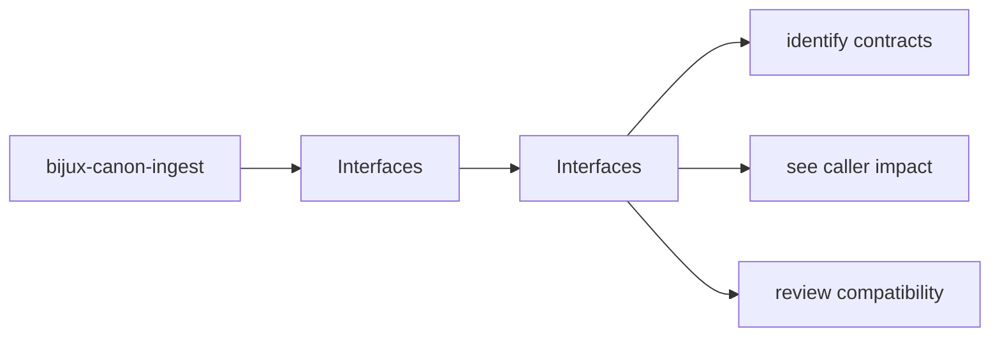
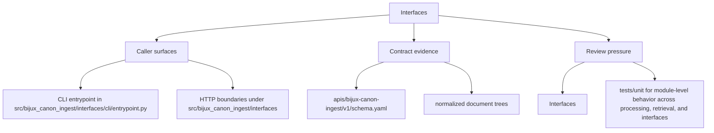

# Interfaces

This section explains which commands, APIs, imports, schemas, and artifacts `bijux-canon-ingest` is prepared to stand behind as real surfaces.

These pages explain the public face of `bijux-canon-ingest`. They help a caller separate deliberate contracts from incidental visibility before a dependency hardens around the wrong surface.

Treat the interfaces pages for `bijux-canon-ingest` as the bridge between implementation detail and caller expectation. They should show what the package is prepared to defend before a dependency forms.

## Page Maps

## Pages in This Section

- [CLI Surface](cli-surface.md)
- [API Surface](api-surface.md)
- [Configuration Surface](configuration-surface.md)
- [Data Contracts](data-contracts.md)
- [Artifact Contracts](artifact-contracts.md)
- [Entrypoints and Examples](entrypoints-and-examples.md)
- [Operator Workflows](operator-workflows.md)
- [Public Imports](public-imports.md)
- [Compatibility Commitments](compatibility-commitments.md)

## Read Across the Package

- [Foundation](../foundation/index.md) when you need the package boundary and ownership story first
- [Architecture](../architecture/index.md) when the question becomes structural, modular, or execution-oriented
- [Operations](../operations/index.md) when the question becomes procedural, environmental, diagnostic, or release-oriented
- [Quality](../quality/index.md) when the question becomes proof, risk, trust, or review sufficiency

## Concrete Anchors

- CLI entrypoint in src/bijux_canon_ingest/interfaces/cli/entrypoint.py
- HTTP boundaries under src/bijux_canon_ingest/interfaces
- configuration modules under src/bijux_canon_ingest/config
- apis/bijux-canon-ingest/v1/schema.yaml

## Use This Page When

- you need the public command, API, import, schema, or artifact surface
- you are checking whether a caller can safely rely on a given entrypoint or shape
- you want the contract-facing side of the package before building on it

## Decision Rule

Use `Interfaces` to decide whether a caller-facing surface is explicit enough to depend on. If the surface cannot be tied back to concrete code, schemas, artifacts, examples, and tests, treat it as unstable until that evidence is visible.

## What This Page Answers

- which public or operator-facing surfaces `bijux-canon-ingest` is really asking readers to trust
- which schemas, artifacts, imports, or commands behave like contracts
- what compatibility pressure a change to this surface would create

## Reviewer Lens

- compare commands, schemas, imports, and artifacts against the documented surface one by one
- check whether a seemingly local change actually needs compatibility review
- confirm that examples still point to real entrypoints and not to stale habits

## Honesty Boundary

This page can identify the intended public surfaces of `bijux-canon-ingest`, but real compatibility depends on code, schemas, artifacts, examples, and tests staying aligned. If those disagree, the prose is wrong or incomplete.

## Next Checks

- move to operations when the caller-facing question becomes procedural or environmental
- move to quality when compatibility or evidence of protection becomes the real issue
- move back to architecture when a public-surface question reveals a deeper structural drift

## Purpose

This page explains how to use the interfaces section for `bijux-canon-ingest` without repeating the detail that belongs on the topic pages beneath it.

## Stability

This page is part of the canonical package docs spine. Keep it aligned with the current package boundary and the topic pages in this section.
